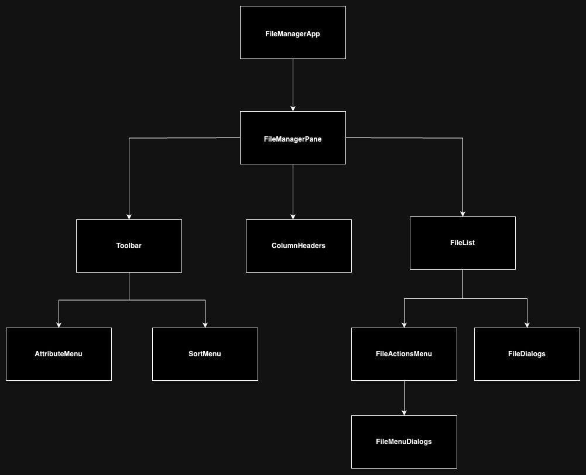
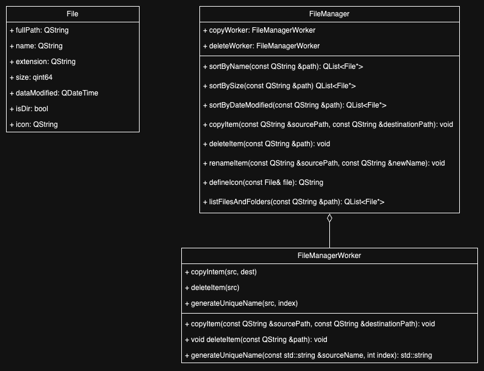

## File Manager Application

### Requirements

#### Application should:
- Should look visually like Total Commander (have two windows).
- Show a catalogue inside every window.
- Show an appropriate icon for different file types
- Show files attributes (file name, extension, file size, date created etc).
- Ability to show/hide some file attributes.
- Ability to sort files by name, size etc.
- Support file/folders operations: copy, move, rename, delete.<br />


  _Note: paste option becomes enabled when you copied or cut an item. 
    <br /> To paste an item you should right-click on a directory where it has to be copied or moved._


- Copying should be handled like in Total Commander from one window to another
- Show progress bar during the operation - **_not implemented_**
- When file/folder is copying, user still can browse the app.
- Non-blocking UI – it should not freeze while using the app.
- Show dialog windows (like confirm deleting etc.)
- Compile for Linux and Windows.

### Project setup and run

#### Prerequisites
1. C++ v17
2. Qt v6+
3. Add Qt path to CMakeLists.txt.
</br>E.g.:
```CMAKE
set(Qt6_DIR "/opt/homebrew/opt/qt/lib/cmake/Qt6")
```

#### Steps to run

1. Run cmake command
```shell
cmake CMakeLists.txt
```
2. Run make command
```shell
make .
```
3. Run
```shell
(optional) chmod +x ./file_manager
./file_manager
```

### QML Components diagram

 

### Uml class diagram

 
